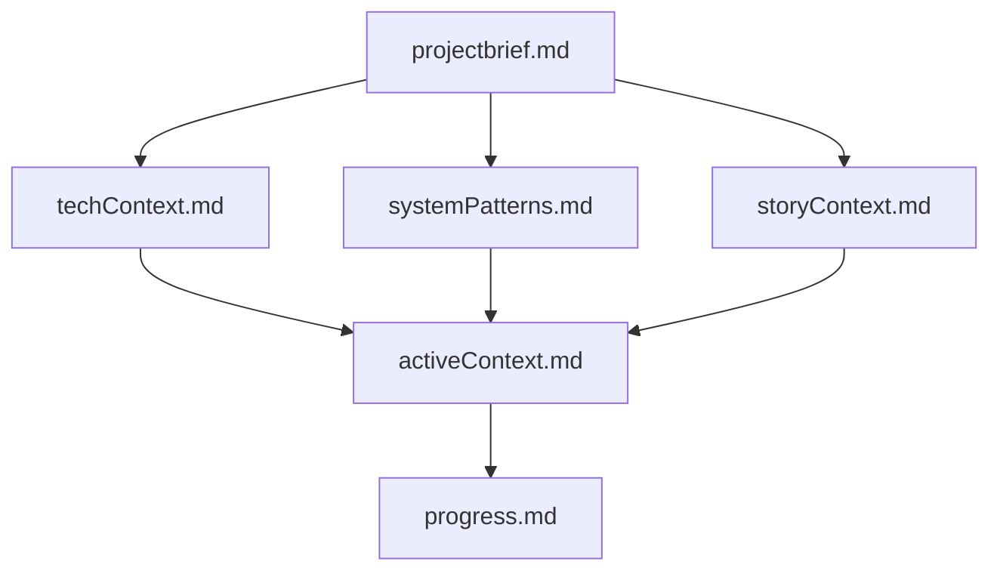
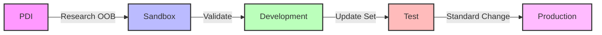

# ServiceNow Development Memory Bank Template

A template for maintaining project context and state in ServiceNow development projects when working with Cursor AI. This template helps ServiceNow developers maintain context between AI chat sessions, especially when working across different environments (PDI, Sandbox, Dev, Test, Prod).

## Project Structure

The memory bank consists of these key files:



1. `storyContext.md` - Story/spike details and acceptance criteria
2. `techContext.md` - Instance and environment information
3. `projectbrief.md` - Project scope and goals
4. `activeContext.md` - Current work focus
5. `progress.md` - Implementation status
6. `systemPatterns.md` - Technical decisions

## Environment Support

This template supports working across ServiceNow environments:



- **PDI**: For OOB behavior research and POCs
- **Customer Sandbox**: For validating solutions with customer data
- **Development**: Primary coding environment
- **Test**: For QA and UAT
- **Production**: Deploy via standard change process

## Interaction Models

### Default Model: Browser-Based Interaction
By default, this template assumes manual interaction with ServiceNow through the web interface. The AI agent will:
- Guide you through manual steps in the browser
- Help document your findings and decisions
- Provide implementation guidance and best practices
- Assist with creating update sets and change requests
- Never attempt direct ServiceNow instance interaction

### Optional: Command-Line Integration
Advanced users can enable command-line interaction with ServiceNow using:

1. **NOW-SDK with Fluent**
   - Official ServiceNow CLI tool
   - Enables scripted interactions
   - Requires explicit configuration
   - Must be enabled per project

2. **VS Code Extensions**
   - SNITCH Canary for ServiceNow development
   - Other ServiceNow-specific extensions
   - Optional and configurable

To enable command-line integration:
1. Update `techContext.md` to specify CLI tools in use
2. Document any CLI-specific configurations
3. Note this in project documentation

## Why Use This Template?

When working with Cursor's Agent AI on ServiceNow development tasks, maintaining context between chat sessions is crucial. This template helps by:

1. **Maintaining Project Memory**
   - Agent AI reads all template files at the start of each session
   - Your story details, instance configurations, and technical decisions are preserved
   - No need to repeat context in every chat

2. **Streamlining Investigation**
   - Document findings about OOB behavior in PDI
   - Track customer-specific configurations in sandbox
   - Compare environments and document differences
   - Agent AI can reference your findings across sessions

3. **Guiding Development**
   - Agent AI understands your environment setup
   - Can suggest appropriate approaches based on your instance
   - Helps maintain consistency across environments
   - Provides context-aware code suggestions

4. **Managing Complexity**
   - Keep track of multiple ServiceNow instances
   - Document environment-specific issues
   - Track dependencies and blockers
   - Maintain a clear development path

## How It Works

1. **Template Files as Memory**
   - Each file serves as a specific aspect of project memory
   - Agent AI reads these files at session start
   - Updates to files persist between sessions
   - Files work together to provide complete context

2. **AI Assistant Integration**
   - Agent AI understands your ServiceNow environment
   - Can reference previous findings and decisions
   - Provides consistent guidance across sessions
   - Helps maintain development standards
   - Guides you through manual ServiceNow interactions
   - Never attempts direct instance interaction by default

3. **Environment Management**
   - Clear documentation of instance differences
   - Safe development practices across environments
   - Consistent approach to changes
   - Better risk management
   - Manual interaction with ServiceNow instances
   - Optional CLI integration for advanced users

## Quick Start

1. **Fork and Clone**
   - Go to https://github.com/markmillr/cursor-memory-servicenow
   - Click "Fork" in the top-right corner
   - Rename your forked repository to match your story/spike (e.g., "story-12345-incident-form")
   - Clone to your machine:
     ```bash
     git clone https://github.com/YOUR_USERNAME/YOUR_REPO_NAME.git
     cd YOUR_REPO_NAME
     ```

2. **Open in Cursor**
   - Open Cursor IDE
   - File > Open Folder > Select your cloned repository
   - Wait for Cursor to index the files

3. **Start Working**
   - Click the chat icon in Cursor's right sidebar
   - Select "Agent" mode
   - Ask "What should I do next?" or "What should I do to get started?"
   - The AI agent will guide you through:
     - Collecting your story/spike details
     - Gathering instance information
     - Setting up project goals
     - Automatically updating all necessary files
     - Manual ServiceNow interaction steps

## Best Practices

1. **Documentation**
   - Keep `storyContext.md` updated with current work
   - Document environment-specific configurations
   - Note any technical decisions made

2. **Environment Safety**
   - Use PDI for initial research
   - Validate in sandbox before dev
   - Never modify production directly
   - Document any environment-specific issues
   - Use manual browser interaction by default
   - Enable CLI tools only when explicitly needed

## Viewing Mermaid Diagrams

### In Cursor
1. Install the "Markdown Preview Mermaid Support" extension
2. Open any markdown file
3. Click the preview icon in the top-right corner
4. Diagrams will render automatically

### On GitHub
- Mermaid diagrams are automatically rendered in markdown files
- No additional setup required
- Diagrams update automatically when you push changes

## License

MIT License

## Acknowledgments

This template was partially inspired by and builds upon several resources:

1. The [Cursor Memory Bank](https://gist.github.com/ipenywis/1bdb541c3a612dbac4a14e1e3f4341ab) by [@ipenywis](https://github.com/ipenywis) (Islem Maboud / CoderOne)
2. [CoderOne's YouTube channel](https://www.youtube.com/@CoderOne) and [Cursor Memory Bank video](https://www.youtube.com/watch?v=Uufa6flWid4)
3. My own previous experiments using Cursor for general research, notetaking, and ServiceNow development

The template has been specifically adapted for ServiceNow development workflows and environment management, with a focus on maintaining context across multiple ServiceNow instances. 