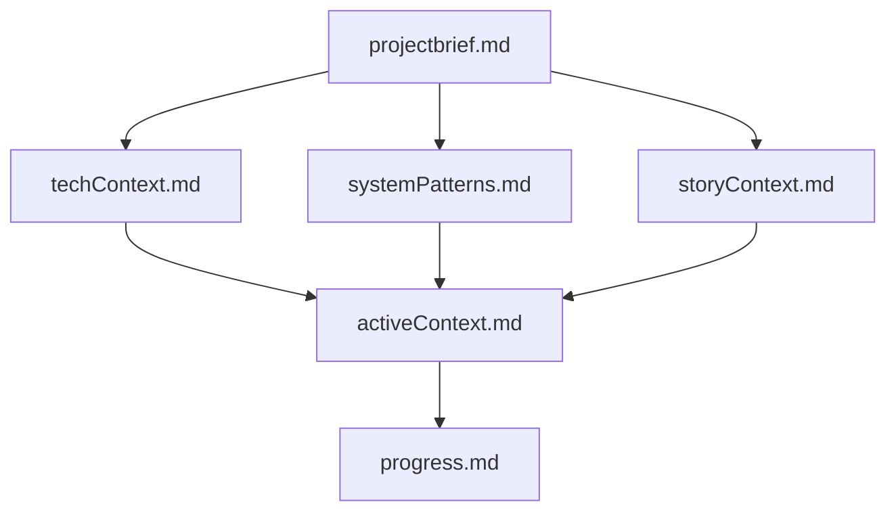
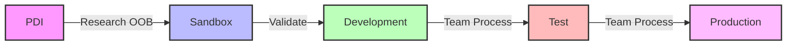

# ServiceNow Development Memory Bank Template

A GitHub template repository for maintaining project context and state in ServiceNow development projects when working with Cursor AI. This template helps ServiceNow developers maintain context between AI chat sessions, especially when working across different environments (PDI, Sandbox, Dev, Test, Prod). You can create multiple private repositories from this template, one for each story or spike you're working on, using GitHub's "Use this template" feature.

## First Interaction with Agent AI

When you first open your new project in Cursor and ask "What should I do next?" or "What should I do to get started?", the Agent AI will:

1. **Understand Your Task**
   ```
   Agent: "I see this is for STRY0127233. Could you tell me about what you're working on?"
   You: "We need to add a new field to the change form to track the change model used. The story mentions this will help with reporting and governance."
   Agent: "Thanks, I'll update storyContext.md with that information. Do you have any acceptance criteria or specific requirements you can share?"
   You: "Yes, the AC says we need to: 1) Add a reference field to point to change models, 2) Make it mandatory for normal changes, 3) Add it to the change reports."
   Agent: "Got it, I've added those acceptance criteria to storyContext.md. And are there any existing work notes or context that would be helpful for me to know about?"
   You: "Yes, there's a note that says this was requested by the Change Advisory Board."
   Agent: "I'll add that context as well. Now, which instance will you be starting your investigation in?"
   ```

2. **Identify Working Environment**
   ```
   You: "I'll start in my PDI to look at the OOB behavior."
   Agent: "Perfect, I'll note that in techContext.md. And will you need to test this in sandbox before moving to dev?"
   You: "No, for this one we can go straight from PDI to dev once we know what we're doing."
   Agent: "I've updated techContext.md with your environment workflow. Based on what we know so far, I think we should start by examining the current change form structure. Would you like to begin there?"
   ```

3. **Guide Investigation**
   ```
   Agent: "Let's start by looking at the current change form and change model structure. Could you open a normal change in your PDI?"
   You: "Ok, I have one open."
   Agent: "Great. Let's first check if there are any existing fields related to change models. Could you look at the form in the browser and also check the dictionary for the change table?"
   You: "I see there's already a change_model field but it's not being used."
   Agent: "Interesting finding! I'll document that in systemPatterns.md since it might affect our implementation approach. Let's investigate why that field isn't being used..."
   ```

4. **Begin Development**
   - Help you understand the current state
   - Guide you through investigating options
   - Suggest manual changes to try in the instance
   - Document findings and decisions in real-time
   - Help with update set creation when needed
   - Continuously update project files with new information

The Agent AI will maintain this context throughout your development process, proactively updating the template files as new information is discovered and using targeted questions to help you explore solutions and document decisions.

## Example Usage

Here's how a ServiceNow developer might use this template with Cursor's Agent AI:

1. **Creating a New Project**
   ```bash
   # First, create your new repository:
   # 1. Go to github.com/markmillr/cursor-memory-servicenow
   # 2. Click the green "Use this template" button
   # 3. Select "Create a new repository"
   # 4. Choose your repository name (e.g., "stry0127233-change-model-tracking")
   # 5. Make sure to select "Private"
   # 6. Click "Create repository from template"
   
   # Then clone your new repository:
   git clone https://github.com/YOUR_USERNAME/stry0127233-change-model-tracking.git
   cd stry0127233-change-model-tracking
   ```

2. **Opening in Cursor**
   - Open the project in Cursor
   - Click the chat icon
   - Select "Agent" mode

3. **Initial Setup**
   ```
   You: "What should I do to get started?"
   Agent: "I see this is for STRY0127233. Could you tell me about what you're working on?"
   You: "We need to add a new field to track which change model was used for each change request."
   Agent: "I'll note that in storyContext.md. Could you share any acceptance criteria or requirements you have?"
   You: "We need to add a reference field to the change form that points to change models, make it mandatory for normal changes, and include it in reports."
   Agent: "Thanks, I've updated storyContext.md with those requirements. Which instance would you like to start investigating this in?"
   You: "I'll start in my PDI to understand how change models work OOB."
   Agent: "I've added that to techContext.md. Let's begin by examining the current change form structure."
   ```

4. **During Development**
   ```
   You: "I've found the change model table, but I'm not sure about the best way to reference it."
   Agent: "I'll document this discovery in systemPatterns.md. Let's look at how ServiceNow handles similar references. Could you check if there are any other reference fields on the change form that might follow a similar pattern?"
   You: "Yes, there's a reference to the assignment group that looks similar."
   Agent: "Perfect, I'll add that pattern to our documentation. This suggests we could use a similar approach for the change model reference."
   ```

5. **Moving to Dev**
   ```
   You: "I've tested the changes in PDI and understand what we need to do."
   Agent: "Great! I've updated progress.md with our findings. Before we recreate the changes in dev, let's review what we learned about the change model structure and the fields we'll need to add."
   ```

The Agent AI maintains context between these interactions, proactively documenting discoveries and decisions in the template files while using targeted questions to help you explore solutions. Each story or spike gets its own private repository, allowing you to maintain separate contexts for different development tasks.

## Important: Repository Privacy

When creating a new repository from this template:

1. **Always Select Private**
   - Make sure to select "Private" when creating your repository
   - Each story/spike repository contains project-specific information
   - Never make your repository public

2. **Data Handling**
   - Never commit sensitive data or credentials
   - Use environment variables or secure secret management
   - Document any sensitive information in a secure location
   - Consider using GitHub's secret scanning feature

3. **Security Best Practices**
   - Keep your repository private
   - Use branch protection rules
   - Enable vulnerability alerts
   - Follow your company's security policies

## Project Structure

The memory bank consists of these key files, which the AI assistant will automatically update based on your responses:



1. `storyContext.md` - Story/spike details and acceptance criteria
2. `techContext.md` - Instance and environment information
3. `projectbrief.md` - Project scope and goals
4. `activeContext.md` - Current work focus
5. `progress.md` - Implementation status
6. `systemPatterns.md` - Technical decisions

## Environment Support

This template supports working across ServiceNow environments:



- **PDI**: For OOB behavior research and POCs
- **Customer Sandbox**: For validating solutions with customer data
- **Development**: Primary coding environment
- **Test**: Follow team's deployment and data practices
- **Production**: Follow team's change management process

### Important: Update Set Management
Update sets are generally NOT transferred between environments, with specific exceptions:

1. **PDI to Sandbox**
   - Update sets are typically not moved from PDI
   - Solutions are recreated from scratch in sandbox
   - Helps ensure clean, maintainable code and avoid conflicts

2. **Sandbox to Dev**
   - Update sets are typically not moved from sandbox
   - Solutions are recreated from scratch in dev
   - Ensures proper handling of customer customizations

3. **Exceptions**
   - Only move update sets in very specific cases
   - Document any exceptions in `systemPatterns.md`

## Interaction Models

### Default Model: Browser-Based Interaction
By default, this template assumes manual interaction with ServiceNow through the web interface. The AI agent will:
- Guide you through manual steps in the browser
- Help document your findings and decisions
- Provide implementation guidance and best practices
- Assist with creating update sets and change requests
- Never attempt direct ServiceNow instance interaction

### Optional: Command-Line Integration
Advanced users can enable command-line interaction with ServiceNow using:

1. **NOW-SDK with Fluent**
   - Official ServiceNow CLI tool
   - Enables scripted interactions
   - Requires explicit configuration
   - Must be enabled per project

To enable command-line integration:
1. Ask Agent AI to update `techContext.md` to specify CLI tools in use
2. Document any CLI-specific configurations
3. Note this in project documentation

## Why Use This Template?

When working with Cursor's Agent AI on ServiceNow development tasks, maintaining context between chat sessions is crucial. This template helps by:

1. **Maintaining Project Memory**
   - Agent AI reads all template files at the start of each session
   - Your story details, instance configurations, and technical decisions are preserved
   - No need to repeat context in every chat

2. **Streamlining Investigation**
   - Document findings about OOB behavior in PDI
   - Track customer-specific configurations in sandbox
   - Compare environments and document differences
   - Agent AI can reference your findings across sessions

3. **Guiding Development**
   - Agent AI learns your environment through targeted questions
   - Can suggest appropriate approaches based on your responses
   - Helps maintain consistency across environments
   - Provides context-aware code suggestions

4. **Managing Complexity**
   - Keep track of multiple ServiceNow instances
   - Document environment-specific issues
   - Track dependencies and blockers
   - Maintain a clear development path

## How It Works

1. **Template Files as Memory**
   - Each file serves as a specific aspect of project memory
   - Agent AI reads these files at session start
   - Updates to files persist between sessions
   - Files work together to provide complete context

2. **AI Assistant Integration**
   - Agent AI understands your ServiceNow environment
   - Can reference previous findings and decisions
   - Provides consistent guidance across sessions
   - Helps maintain development standards
   - Guides you through manual ServiceNow interactions
   - Never attempts direct instance interaction by default

3. **Environment Management**
   - Clear documentation of instance differences
   - Safe development practices across environments
   - Consistent approach to changes
   - Better risk management
   - Manual interaction with ServiceNow instances
   - Optional CLI integration for advanced users

## Quick Start

1. **Create New Repository from Template**
   - Go to https://github.com/markmillr/cursor-memory-servicenow
   - Click the green "Use this template" button
   - Select "Create a new repository"
   - Name your repository to match your story/spike (e.g., "stry0127233-change-model-tracking")
   - **Important:** Select "Private" for repository visibility (this is not the default)
   - Click "Create repository from template"
   - Clone to your machine:
     ```bash
     git clone https://github.com/YOUR_USERNAME/YOUR_REPO_NAME.git
     cd YOUR_REPO_NAME
     ```

2. **Open in Cursor**
   - Open Cursor IDE
   - File > Open Folder > Select your cloned repository
   - Wait for Cursor to index the files

3. **Start Working**
   - Click the chat icon in Cursor's right sidebar
   - Select "Agent" mode
   - Ask "What should I do next?" or "What should I do to get started?"
   - The AI agent will guide you through:
     - Collecting your story/spike details
     - Gathering instance information
     - Setting up project goals
     - Automatically updating all necessary files
     - Manual ServiceNow interaction steps
     - Optional GitHub integration setup

## GitHub Integration

The AI agent can automatically commit and push changes to your private GitHub repository. This feature is optional and requires:

1. **Basic Git Setup**
   - Git installed on your machine
   - Basic Git configuration (name and email)
   - No GitHub CLI required

2. **Authentication Options**
   - HTTPS with personal access token (recommended for beginners)
   - SSH with configured keys (advanced setup)
   - GitHub CLI (optional)

3. **Features When Enabled**
   - Automatic commits with descriptive messages
   - Regular pushes to your private repository
   - No manual Git commands needed
   - Context preservation across sessions

4. **Setup Process**
   - AI agent will ask if you want to enable GitHub integration
   - Guides you through authentication setup if needed
   - Explains the benefits and requirements
   - Can be enabled/disabled at any time

5. **Security Considerations**
   - Only works with private repositories
   - No sensitive data is committed
   - Follows security best practices
   - Respects your repository's privacy settings

## Best Practices

1. **Documentation**
   - AI Agent keeps `storyContext.md` updated with current work
   - Document environment-specific configurations
   - Note any technical decisions made

2. **Environment Safety**
   - Use PDI for initial research
   - Validate in sandbox before dev
   - Never modify production directly
   - Document any environment-specific issues
   - Use manual browser interaction by default
   - Enable CLI tools only when explicitly needed

## Viewing Mermaid Diagrams

### In Cursor
1. Install the "Markdown Preview Mermaid Support" extension
2. Open any markdown file
3. Click the preview icon in the top-right corner
4. Diagrams will render automatically

### On GitHub
- Mermaid diagrams are automatically rendered in markdown files
- No additional setup required
- Diagrams update automatically when you push changes

## License

MIT License

## Acknowledgments

This template was partially inspired by and builds upon several resources:

1. The [Cursor Memory Bank](https://gist.github.com/ipenywis/1bdb541c3a612dbac4a14e1e3f4341ab) by [@ipenywis](https://github.com/ipenywis) (Islem Maboud / CoderOne)
2. [CoderOne's YouTube channel](https://www.youtube.com/@CoderOne) and [Cursor Memory Bank video](https://www.youtube.com/watch?v=Uufa6flWid4)
3. My own previous experiments using Cursor for general research, notetaking, and ServiceNow development

The template has been specifically adapted for ServiceNow development workflows and environment management, with a focus on maintaining context across multiple ServiceNow instances. 
